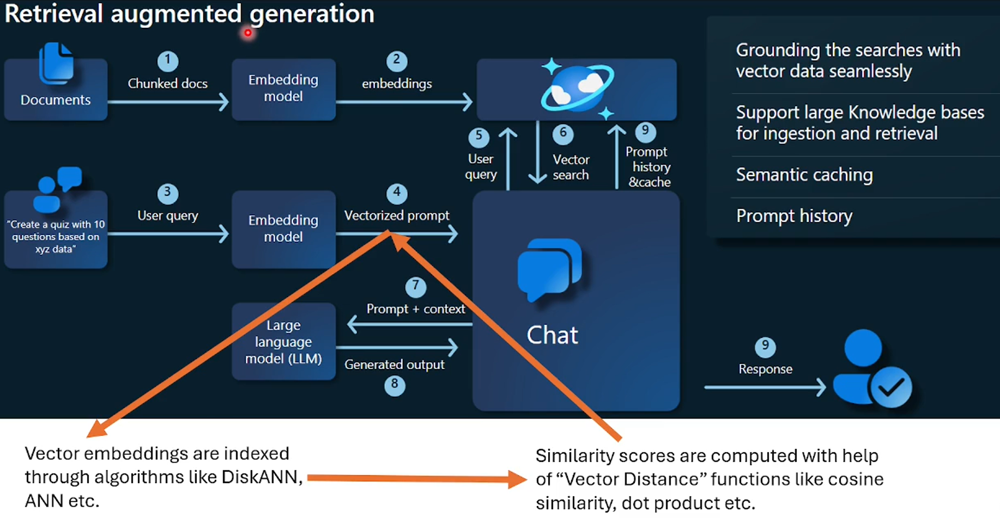
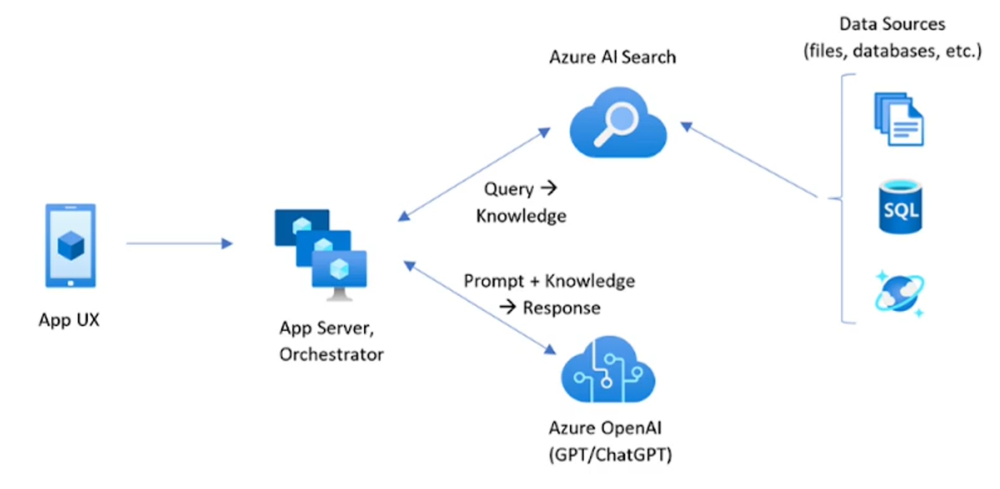

# RAG (Retrieval Augumented Generation)
It helps Gen AI to answer queries that requires information from your organization document or database.
    - Retrieval: function that retrieves the documents that match best to answer the user prompt query.
    - Augument: Combines the content of the documents retrieved with the user prompt. and then present it to LLM.
    - Generation: LLM model generates answers to the user based on the combination of user prompt and document contents that it has been provided with.

## How do you achieve it with Azure
Azure AI Search is a proven solution for information retrieval in a RAG architecture. It provides indexing and query capabilities with the infrastructure and security of the Azure Cloud. 
It can connect to data sources like files in storage, or databaes like SQL / CosmosDB.

### Vector Embedding (Heart of RAG)
Vector embeddings are a way of representing data (such as words, sentences, images, or other types of data) in a numerical format that captures semantic or meaningful relationships between the data points. These representations are used extensively in machine learning, natural language processing (NLP), and other AI tasks.

These vector embeddings are generated by text-embedding models that are offered by Azure Open AI. (e.g. ada-002, davinci-001 model).

Embedding data store options in Azure:
    - Azure Cognitive (AI) Search (Ideal for full-text search combined with vector simillar search). It provides inbuilt indexing, scoring, and traditional keyword based search.
    - Azure Cosmos dB (It's a globally distributed dB. Ideal for high availability & scalability.). Provides ANN indexing & low-latency query.
    - Azure Redis Cache (Suitable for rapid search)

### Azure Resources Setup Needed
    - Storage Account
    - User Managed Identity (name: genaipocmi)
    - Assign "Storage Blob Data Contributor" role to the managed identity on the storage account.
    - Azure AI Search Service
    - Configure Azure AI Search to run under the user managed identity
    - Go to Storage Account >> Data Storage >> Containers, create a new container and upload the documents that need to be indexed.
    - Go to Search Service >> Search Management >> Data Sources, add the container as data source here.
    - Go to Search Service >> Overview >> Import Data, Import the data source created above, and configure the indexing and searchable fields.
    - Assign the role "Search Index Data Contributor", "Search Index Data Reader" & "Search Service Contributor" to the managed identity and USER using portal on the Azure AI Search service. This enables the id to read the index.

 ### Sample app code (that uses files stored in a storage account)
 ./oai/rag1.py
 
### What is Azure AI Search?
It contains only your data, which can include text inferred or extracted from images, or new entities and key phrases detection through text analytics.
You can feed unstructured data like pdf, pptx, xlsx, docx, txt files. It can be multi-model data with image & texts. 
It is capable of vector search, full text and hybrid search.

### Pain Areas in RAG
    - Incorrect Answering: RAG system provides a plausible, but incorrect answer when the actual answer is not in the knowledgebase, rather than stating it does not know. Solutions to this as belows:
        - Better system prompting
        - Cleaning data
    
    - Missed the Top Ranked Documents: Both "chunk_size" and "similarity_top_k" are the parameters used to manage the efficiency and effectiveness of the data retrieval process in the RAG. Adjusting these parameters can impact the trade-off between computational efficiency and the quality of retrieved information. Solution to this problem is as belows:
        - Redce the chunk size (it requires more computation)
        - Setting the semantic similarity parameter (top parameter to LLM)
    
    - Not Extracted: System struggles to extract the correct answer from the provided context, especially when overloaded with information. Key details are missed, compermising the quality of responses. The paper hinted: "this occurs when there is too much noise or contradicting information in the context". 
        - Solution is cleaning your data. E.g. there are 2 documents with contradicting data. one says a formal education is required for a politician. The other document says no formal education is needed for a politician. 

    - Wrong Output Format. Solution to this is:
        - Better prompting (give few shot examples)
        - Use StrOutputParser() in langchain

    - Data Ingestion Scalability: Arises when the system struggles to efficiently manage and overlook large volumes of data. It can lead system overload error and long time to retrieve.
        - Solution: Use parallel indexing. (Divide the docs into multiple blob storage, create seprate index for each container using separate indexer. Run parallel indexing queries and configure each of those indexes to write to parent index.)

    - Data Extraction from Unstuctured Data: Extra data from complex pdf containing tables & graphs. You need a better way to retrieve such complex pdf data. Solution:
        - Azure AI Search Index
        - Azure Document Intelligence
        - Azure Faiss Index

    - Security: Prevent sensitive information disclosure, hacking attempts are all pressing questions every AI architect and engineer needs to answer. Solutions are:
        - Azure KV
        - RBAC / MFA
        - Service Endpoint
        - Private Endpoint
        - Do not use public Open AI (it has shared db)
    

### Form Recognizer

    
