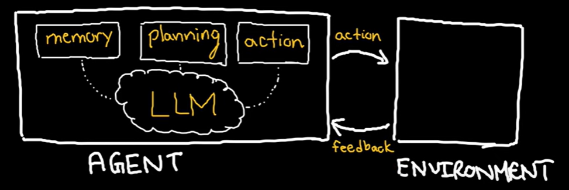

## LLM Agent
An LLM Agent is a system with a LLM at its core that interacts with its environment to perform high-level tasks. It achieves this by leveraging additional modules including memory, planning and action.

    - Memory stores context so the LLM can generate accurate, relevant data.
    - Planning generates step by step action plans.
    - Action enables interaction with the environment (physical or virual).

### LLM vs RAG vs LLM Agent
Let's understand this with a simple example where you prompt the AI with the message "I spilled food. Can you clean this up?" & few-shot examples.

#### what LLM does?
LLM generates a plan that make sense. For example:
- Get vaccum cleaner
- Identify spill area
- Use vaccum cleaner to clean spill
- Done

But, LLM can't perform action or interaction with the environment. It does not have tools to interact with the environment. E.g. It can't get the vaccum cleaner.

#### What RAG does?
RAG has access to memory store where it stores the information of the environment and tools available. It talks about what each tool can do with contextual examples.

Again, RAG can't interact with the environment. It can't take feedback.

#### What Action does?
Action performs the action and get's feedback from the environment.
- Scan the area (using computer vision tool) and store in memory
- Get the vaccum
- Vaccum the area
- Scan the area (get the feedback)
- Mop area
- Scan the area (get the feedback)
- Done

