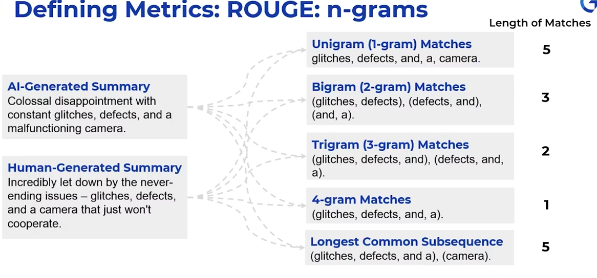

# LLM Evaluation
A LLM performs following type of tasks:
- Text Processing (Summerization, Translation, Rephrasing)
- Q & A (Factual answering)
- Text Undestanding (Classification)

## Evaluating LLM on Classification Task (TEXT-to-LABEL)
For classification, you can use accuracy score which is nothing but the % of match compared with actual labels.

## Evaluating LLM on Summerization Task (TEXT-to-TEXT)

### ROUGE-L F1 score

$$
ROGUE-L = 2PR / (P+R)
$$

Where P stands for precission and R stands for Recall.

$$
 P = (Longest Common Subsequence)/(Tokens in AI Generated Summary)
$$

$$
 R = (Longest Common Subsequence)/(Tokens in Human Generated Summary)
$$

A good F1 score is between 0.2 to 0.5.

F1 score is based on word matches. Hence, it is good for evaluating extractive summary, but not good for abstractive summary. In abstractive summerizzation, the LLM could generate a complete different set of words with same meaning though.

### BERT Score
Transformer captures the contextual meaning of words in embedding which helps it to find words with same symantic meaning. Because BERT score uses embeddings, it gives more accuracy in evaluating abstract summary.

### LLM Quality Rating
In this approach, we send the INPUT to LLM-1, and capture the OUTPUT. Then, send the INPUT & OUTPUT to another LLM-2 to judge and find how accurate they are.

